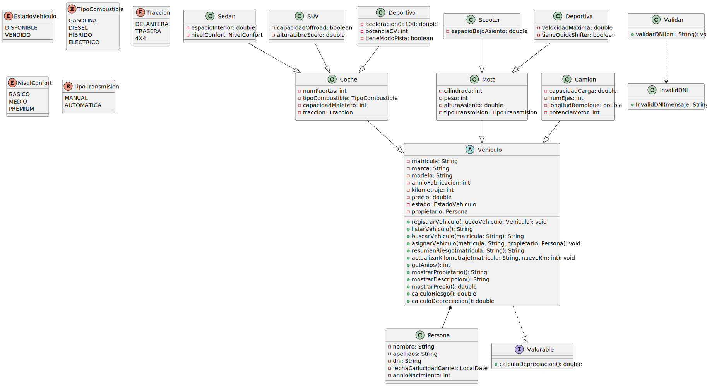

# Tareas

## Creación del repositorio
- [x] Crear repositorio `UT5_ED_Prog` en GitHub
- [x] Hacer el primer commit
- [x] Crear carpeta `uml/`

## Análisis y diseño de clases
- [x] Analizar el enunciado
- [x] Identificar clases principales y relaciones
- [ ] Identificar atributos, métodos y tipos de datos
- [ ] Aplicar herencia, composición e interfaces

## Modelado y UML
- [ ] Crear un `.puml` por cada clase en la carpeta `uml/`
- [x] Rellenar cada clase con sus correspondientes atributos
- [ ] Definir atributos con tipos y visibilidad
- [ ] Definir métodos
- [ ] Establecer relaciones
- [ ] Crear diagrama `diagrama_clases.svg`
- [ ] Insertar diagrama en este README
- [ ] Documentar todo en el `README.md`
---
# Documentación

## Diseño de clases

### Clases
- Vehiculo (abstracta)
  - Coche
    - Sedan
    - SUV
    - Deportivo
  - Moto
    - Scooter
    - Deportiva
- Camión
- Persona

### Interfaz
- Valorable

### Relaciones
- **Herencia:** Vehiculo → Coche, Moto, Camión
- **Subtipos:** Coche → Sedan, SUV, Deportivo / Moto → Scooter, Deportiva
- **Composición:** Vehiculo contiene un propietario de tipo Persona
- **Implementación:** Vehiculo implementa Valorable

---

## Diagrama de clases



---

## Estructura

```
UT5_ED_Prog/
├── README.md
├── src/
└── uml/
    ├── Vehiculo.puml
    ├── Persona.puml
    ├── Coche.puml
    ├── Moto.puml
    ├── Camion.puml
    ├── SUV.puml
    ├── Sedan.puml
    ├── Deportivo.puml
    ├── Scooter.puml
    ├── MotoDeportiva.puml
    ├── Valorable.puml
    └── diagrama_clases.svg
```