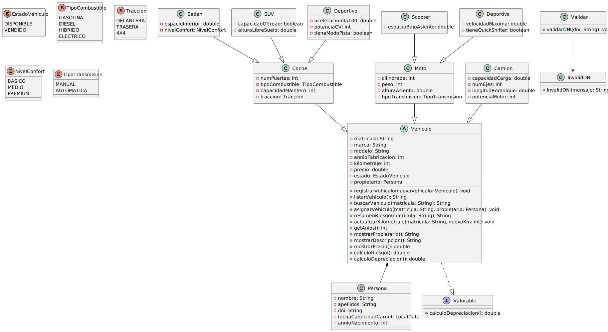

# Tareas

## Creación del repositorio
- [x] Crear repositorio `UT5_ED_Prog` en GitHub
- [x] Hacer el primer commit
- [x] Crear carpeta `uml/`

## Análisis y diseño de clases
- [x] Analizar el enunciado
- [x] Identificar clases principales y relaciones
- [x] Identificar atributos, métodos y tipos de datos
- [x] Aplicar herencia, composición e interfaces

## Modelado y UML
- [x] Crear un `.puml` en la carpeta `uml/` que contenga todas las clases e interfaces.
- [x] Rellenar cada clase con sus correspondientes atributos
- [x] Definir atributos con tipos y visibilidad
- [x] Definir métodos
- [x] Establecer relaciones
- [x] Crear diagrama `diagrama_clases.svg`
- [x] Insertar diagrama en este README
- [x] Documentar todo en el `README.md`
---
# Documentación

## Diseño de clases

### Clases
- Vehiculo (abstracta)
  - Coche
    - Sedan
    - SUV
    - Deportivo
  - Moto
    - Scooter
    - Deportiva
- Camión
- Persona
- Validar
  - InvalidDNI

### Interfaz
- Valorable

### Relaciones
- **Herencia:** Vehiculo → Coche, Moto, Camión
- **Subtipos:** Coche → Sedan, SUV, Deportivo / Moto → Scooter, Deportiva
- **Composición:** Vehiculo contiene un propietario de tipo Persona / Validar contiene InvalidDNI
- **Implementación:** Vehiculo implementa Valorable

---

## Diagrama de clases

